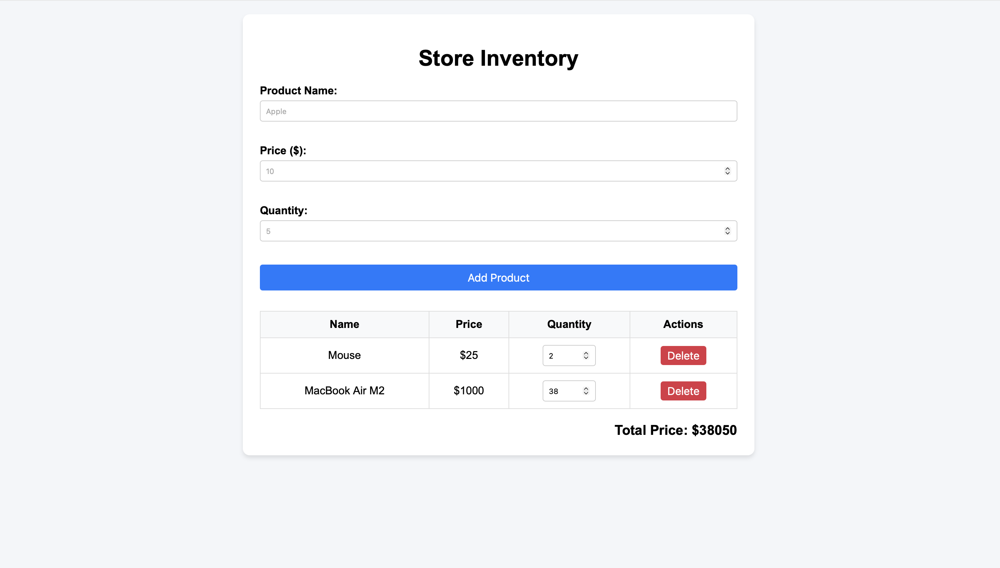

# DOM Store Application — Lab 5

- **Author:** Akbota Bostandyk (IT1-2305)
- **Repository:** https://github.com/botacorre/dom-store-bostandyk

---

## How to Open

1. Clone or download the repository.
2. Open the `index.html` file in any browser (or use VS Code Live Server).

---

## Event Handling Overview

In this project, I handled `submit`, `click`, and `input` events:
- **`submit` on form:** Intercepted with `preventDefault()` to run custom DOM validations and insert products dynamically without refreshing the page.
- **Event Delegation on `click` & `input`:** Instead of attaching listeners to every row, I placed listeners on the `<tbody>` parent element (`#products-list`).
- The `click` event catches delete actions, and the `input` event updates quantities dynamically, enabling real-time `total` calculation without DOM re-renders for every single keystroke.

---

## Page Screenshot

---

## AI Tools Used

During the development of this project, **Gemini AI** was utilized:
* **UI Structure & Event Delegation:** Assisted in setting up clean event delegation on table elements.
* **Documentation:** Helped structure and formulate technical explanations in English for this `README.md`.